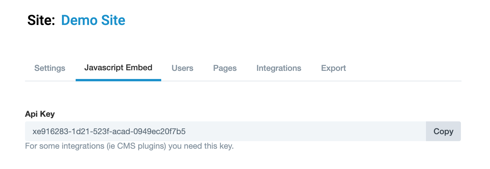

# PageProofer plugin for Craft CMS 3.x

## The easiest way to request changes and report bugs on your website!

## Requirements

- This plugin requires Craft CMS 3.0.0 or later.
- A paid PageProofer subscription, [free 15 day trial](https://pageproofer.com/sign-up)

## Installation

To install the plugin, follow these instructions.

1. Open your terminal and go to your Craft project:

        cd /path/to/project

2. Then tell Composer to load the plugin:

        composer require dgrigg/pageproofer

3. In the Control Panel, go to Settings → Plugins and click the “Install” button for PageProofer.

## PageProofer Overview
PageProofer allows you to gather feedback, request content changes, reports bugs, and track issues directly on your website. This add on will add the PageProofer overlay to the website you are visiting, allowing you to quickly leave feedback. It will only work on websites that you allow PageProofer to be used on. A paid subscription is required, there's a free 15 day trial.

Anytime an issue is added via PageProofer on your website you can attach screenshots, attachments and comments to help explain the issue. PageProofer will automatically capture your browser details and the page url to help make reporting the issue as easy as possible. PageProofer integrates with leading project management and bug tracking software like BaseCamp, Jira, Teamwork and Trello to make your teams even more productive and to simply your team communication.

To learn more about how PageProofer works and to see the subscription options please visit https://pageproofer.com.

## Configuring PageProofer
A paid subscription is required, there's a free 15 day trial. Once you have your PageProofer account setup:
1. Add a site in PageProofer. Here's a [guide](https://pageproofer.com/help/getting-setup) if you need help.
2. Copy the api key value from the 'Javascript Embed' tab

3. Paste the api key value into the plugin settings for PageProofer

4. Make sure the Enabled settings is set to on to begin using PageProofer on your website.

## Using PageProofer
With PageProofer added to your site, and enabled, visit any page on your website. When you want to add a PageProofer note, click the PageProofer icon in the corner to open PageProofer on your website and then double click anywhere to add a note. As notes are added a counter will be displayed on the icon to let you know the page has notes on it.

Brought to you by [PageProofer](https://pageproofer.com)
